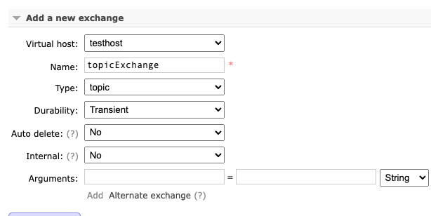
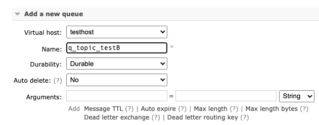
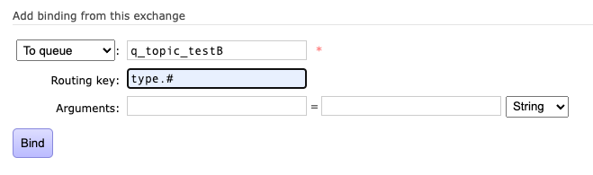

# simple
通过通道声明队列，通过通道将消费者或者生产者绑定到某个队列上

# 5.3.Work模式

1. 如果默认情况下，如果不设置Qos、不设置手动确认信息，如果此时mq有2个消费者，那么**之后**的消息会交替地发给这两个消费者；
2. 如果默认情况下，如果不设置Qos、不设置手动确认信息，mq不为空，如果此时接入了两个消费者，那么由于不设置Qos，mq会将消息尽可能多地发送给消费者，所以结果就是数据都发给同一个消费者了；
3. 个人理解qos：Request a specific prefetchCount "quality of service" settings for this channel 指的是，在未收到消费者确认的消息，最多可以累积多少条'

# 5.6.订阅模式(fanout)

先用通道创建两个队列

再为两个通道各自注册1个消费者。

生产者将消息发到交换机里，fanout模式会将这个消息下发到其中的全部队列。

# 5.7 路由模式（direct）

# 5.7 主题模式(topic)
先创建两个队列，将两个队列绑定到某个交换机上，这个交换机是topic类型的；

生产者生成一个消息，把这个消息送给某个交换机，交换机根据routing-key，把这个消息送进不同符合通配符的队列

# 订阅、路由、主题的区别
区别在于交换机给子队列分发数据的规则不同；
订阅是全发、路由是直接相等才发、主题是匹配上就发

# 6.Spring-Rabbit

做的事情，做的bean是：一个queue，一个exchange，将这个queue绑定到这个exchange；
将让Foo对象的listen方法绑定到这个queue，自动消费这个queue；

# 7. 完整spring例子

## 创建交换机

## 创建队列

## 将队列绑定交换机

